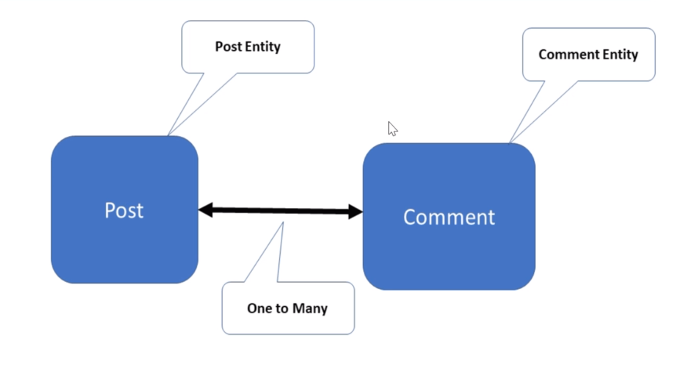
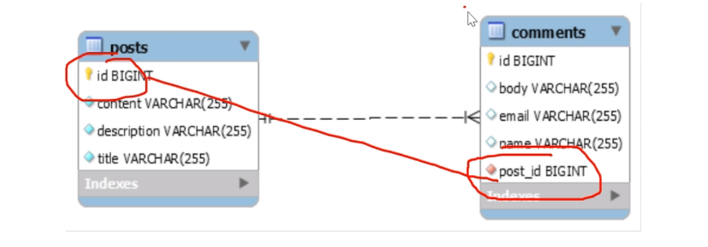
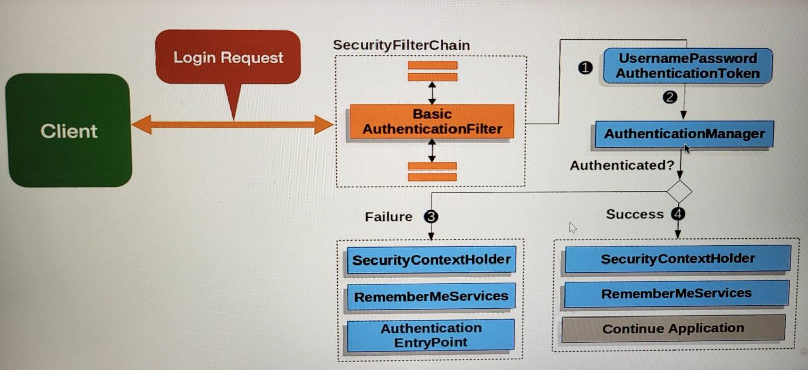
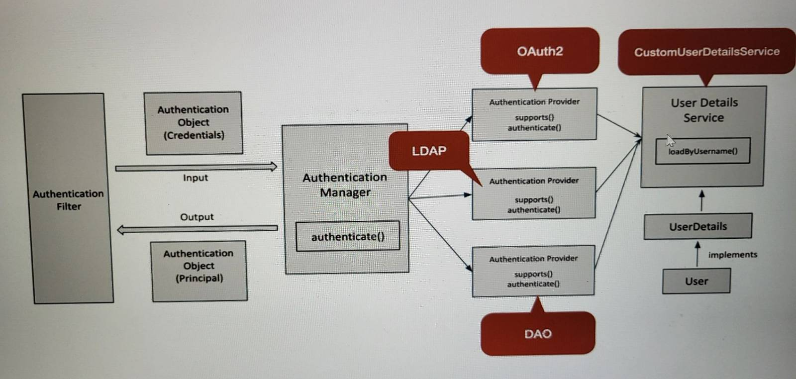
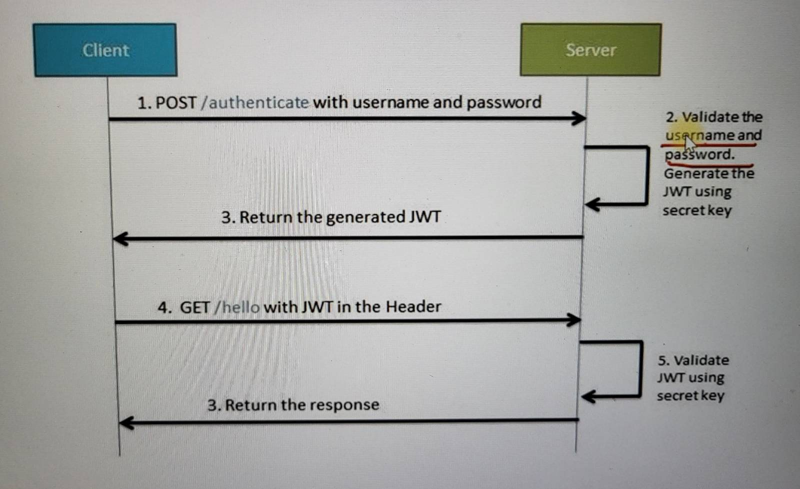

# Blog-App


## Paging and Sorting
- Paging and Sorting is mostly required when we are displaying domain data in tabular format in UI
- Pagination consists of two fields: page size, page number. Sorting is done on a single of multiple fields in the table.
- Defining default values for pageNo is 0 and pageSize = 10
- Changing existing get all posts REST API to provide pagination support
- Generally, paging and sorting parameters are optional and this part of request URL as query parameters.
- The default paging and sorting values shall be clearly documented in API docs.
- Examples:
    - http://localhost:8080/api/posts?pageSize=5
    - URL: http://localhost:8080/api/posts?pageSize=5&pageNo=1
    - URL: http://localhost:8080/api/posts?pageSize=5&pageNo=1&sortBy=title

### Pagination Support for Get All Posts REST API
- privateList<Post> content;
- private int pageNo;
- private int pageSize;
- private long totalElements;
- private int totalPages;
- private boolean last;

## One to Many Relationship (Bi-Directional)


Primary Key (id) of Post table becomes Foregin Key in the Comments Table -->  One to Many


The FetchType.LAZY tells Hibernate to only fetch the related entities from the database when you use the relationship.

----------------------------------------------------------

## ModelMapper
- Step 1: Add ModelMapper Library Dependency
- Step 2: Define the ModelMapper Bean in our Spring Configuration
    ```java
        @Bean
        public ModelMapper modelMapper() {
            return new ModelMapper();
        }
    ```
- Step 3: Inject and Use ModelMapper:
    ```java
        private ModelMapper mapper;
        public PostServiceImpl(PostRepository postRepository, ModelMapper mapper) {
            this.postRepository = postRepository;
            this.mapper = mapper;
        }
    ```

----------------------------------------------------------------

## Exception Handling

### Annotations for Exception Handling
- **@ExceptionHandler**: is an annotation used to handle the specific exceptions and sending the custom reponses to the client
- **@ControllerAdvice**: is an annotation to handle the exceptions globally

### Development Process
- Create ErrorDetails Class
- Create GlobalExceptionHandler Class
- Test using Postman Client

------------------------------------------------------------------

## Java Bean Validation Basics
- We validate a Java Bean with the standard framework - JSR 380, also known as Bean Valiation 2.0
- Validating user input is a suepr common requirement in most applications. And the Java Bean Validation framework has become the de facto standard for handling this kind of logic
- JSR 380 is a specification of the Java API for bean validation and this ensures that the properties of a bean meet specific criteria, using annotations such as @NotNull, @Min, and @Max
- Hibernate Validator is the reference implementation of the validation API

### Important Bean Validation Annotations
- **@NotNull**: validates that the annotated property value is not null
- **@Size**: validates that the annotated property value has a size between the attributes min and max; can be applied to String, Collection, Map and array properties
- **@Min**: validates that the annotated property has a value no smaller than the value attribute
- **@Max**: validates that the annotated property has a value no larger than the value attribute
- **@Email**: validates that the annotated property is a valid email address
- **@NotEmpty**: validates that the property is not null or empty; can be applied to String, Collection, Map or Array values
- **@NotBlank**: can be applied only to text values and validates that the property is not null or whitespace

### Validation in Spring Boot
- Spring Boot provides good integration support with Hibernate validator
- We will use Hibernate Validator, which is one of the refernce implementations of the bean validation API
- Starting with Boot 2.3, we need to explicityly add the spring-boot-starter-validation dependency:
    ```xml
        <dependency>
            <groupId>org.springframework.boot</groupId>
            <artifactId>spring-boot-starter-validation</artifactId>
        </dependency>
    ```

### Java Bean Validation Basics
- We validate a Java bean with the standard framework - JSR 380, also known as Bean Validation 2.0
- Validating user input is a super common requirement in most applications. And the Java Bean Validation framework has become the de facto standard for handling this kind of logic.
- JSR 380 is a specification of the Java API for bean validation and this ensures that the properties of a bean meet specific criteria, using annotations such as @NotNull, @Min and @Max
- Hibernate Validator is the reference implementation of the valiation API

### Development Process
1. Add maven dependency
2. Apply validation annotatons to a PostDto bean. For example, @NotNull, @NotBlank, and @Size annotations etc.
3. Enable validation on Spring Rest Controller by adding @Valid annotation in addition to @RequestBody
4. To customize response validation we need to extend **ResponseEntityExceptionHandler** class and override *handleMethodArgumentNotValid(MethodArgumentNotValidException ex, HttpHeaders headers, HttpStatus status, WebRequest request)* method.

------------------------------------------------------------------------------------------------------------------------

## Spring Boot Auto Configuration for Spring Security
- Spring Boot Auto configures below features:
    - **spring-boot-starter-security**: starter that aggregates Spring Security-related dependencies together
    - Enables Spring Security's default configuration, which creates a servlet Filter as a bean names **springSecurityFilterChain**. Provides default login form for you
    - Creates default user with a username as **user** and a randomly generated password that is logged to the console (Ex: 8e335757-8572090-57y350-y50yv9b-0y85vh859)
    - Spring boot provides properties to customize default user's username and password
    - Protects the password storage with **BCrypt** algorithm
    - Lets the user log out (default logout feature)
    - CSRF attack prevention (enabled by default)
    - If Spring Security is on the classpath, Spring Boot automatically secures all HTTP endpoints with "basic" authentication

## How Basic Authentication Works


---------------------------------------------------------------------------------------------------------------------------

## Securing REST APIs using In-Memory Authentication

## How Database Authentication Works


-------------------------------------------------------------------------------------

## JWT
- JSON Web Token (JWT) is an open standard (RFC 7519) that defines a compact and self-contained way for securely transmitting information between parties as a JSON object
- JWT is mostly used for securing REST APIs
- JWT follows stateless authentication mechanism

### When should you use JSON Web Tokens?
- Authorization
- Information Exchange

### Structure of JWT
- JWT consists of three parts separated by dots (.) which are:
    - **Header**:
        ```
            {
                "alg": "HS256",
                "typ": "JWT"
            }
        ```
    - **Payload**:
        ```
            {
                "sub": "1234567890",
                "name": "John Doe",
                "admin": true
            }
        ```
    - **Signature**:
        ```
            HMACSHA256(base64URLEncode(header) + "." + base64UrlEncode(payload), secret)
        ```

- Ex: xxxxxx.yyyyyy.zzzzz
- Token Ex: oviyVIUYviyvYvi.huebuevIGYiVYyVYIvyiVY.viVYfIGiyFJVKjvFJrj



### Development Steps
1. Add JWT related Maven dependencies
2. Create JwtAuthenticationEntryPoint
3. Add Jwt properties in application properties file
4. Create JwtTokenProvider - Utility Class
5. Create JwtAuthenticationFilter
6. Create JwtAuthResponse DTO
7. Configure JWT in Spring Security
8. Change Login/Signin REST API to return JWT Token

